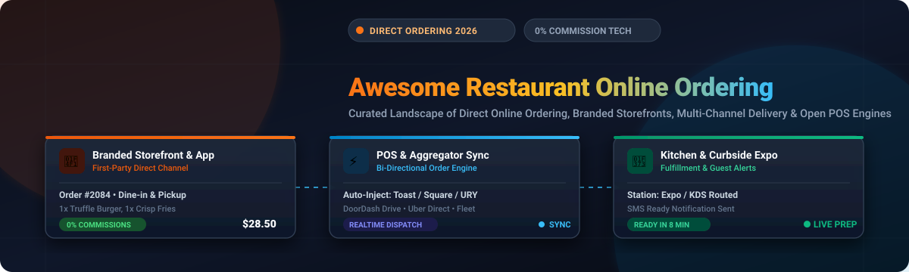

  

# 🍽️ Awesome Restaurant Online Ordering Ecosystem 🛵

  

---

## 🌟 Curated List of SaaS Products & Open-Source GitHub Projects

> **🔍 Keywords / SEO Focus**: *Restaurant Online Ordering System, Commission-Free Online Ordering, Branded Restaurant Website Ordering, Direct-to-Consumer Restaurant Tech, Restaurant POS Online Ordering Integration, Pickup & Delivery Ordering Platform, White-Label Restaurant App, Menu Management Software, Multi-Location Restaurant Ordering, Self-Hosted Restaurant Ordering System, Open-Source Restaurant POS, Digital Storefront for Restaurants, Zero-Commission Restaurant Platform, Delivery Management for Restaurants, QR Code Ordering System.*

**📅 Last updated: September 2026**

This repository tracks notable **SaaS platforms** and **open-source projects** for **Restaurant Online Ordering**. These systems let restaurants accept orders for pickup and delivery through their own branded website or app, manage menus, process payments, and send tickets to the kitchen—often with the goal of reducing reliance on third-party marketplace commissions.

**✨ Examples** include ChowNow, GloriaFood, Owner.com, Flipdish, Deliverect, Lunchbox, Otter, Square Online, Toast Online Ordering, and Menufy (the category leaders).

**🔓 Open-source emphasis**: Full-featured, multi-location online ordering platforms with marketing tools, advanced delivery integrations, and polished guest experiences are mostly commercial. There is, however, a useful open-source ecosystem of restaurant POS + online ordering systems (**TastyIgniter**, **URY**, **KitchenAsty**, and others) that support self-hosted direct ordering.

💡 Contributions welcome! Open a PR to add/update entries. Keep descriptions factual and link to official sites.

---

## 📑 Table of Contents

- [📊 Market Overview & Industry Structure](#-market-overview--industry-structure)
- [☁️ SaaS / Hosted Platforms](#️-saashosted-platforms)
- [💻 Open-Source GitHub Projects](#-open-source-github-projects)
- [🤝 How to Contribute](#-how-to-contribute)
- [📈 Star History](#-star-history)
- [⚠️ Disclaimer](#️-disclaimer)

---

## 📊 Market Overview & Industry Structure

> 🌐 **Estimated Sector Market Size & Structure**: The global Restaurant Online Ordering market is valued at approximately **$5 Billion – $8 Billion USD** (direct-ordering SaaS platforms and white-label ordering engines), embedded within the broader **$35+ Billion USD** restaurant POS software & foodservice technology ecosystem, and is growing at an estimated **CAGR of ~14% – 18%**. The sector is **moderately fragmented**: large integrated POS conglomerates (Block/Square, Toast, Oracle) command significant share through vertically bundled suite offerings, while high-growth commission-free specialists (ChowNow, Owner.com, Flipdish, Lunchbox) compete aggressively for independent and multi-location restaurant operators seeking to reduce marketplace dependency. No single vendor has achieved "winner-take-all" dominance — operator loyalty tends to follow POS ecosystem lock-in rather than ordering-platform differentiation alone.

---

## ☁️ SaaS/Hosted Platforms

*The following table lists leading commercial SaaS online ordering solutions, **sorted in descending order by parent company scale (Revenue / Valuation / Market Cap)**.*

| Platform | Description & Key Features | 🏢 Company Scale | 💰 Starting Tier Pricing | 🎁 Free Tier / Free Trial Limits |
| :--- | :--- | :--- | :--- | :--- |
| **[Square Online](https://squareup.com/online)** | Accessible online ordering and website builder integrated into Square POS. Supports pickup, local delivery dispatch, and QR-code table ordering. | **~$40B–$50B Market Cap** *(Block, Inc., NYSE: SQ; Annual Revenue: ~$22B+)* | **$0/mo** software fee *(3.3% + 30¢ per transaction)*; **Plus** plan starts at **$29/mo** *(billed annually)* or **$49/mo** *(billed monthly, 2.9% + 30¢ per transaction)*. | **Permanent Free Tier:** **$0/mo** with unlimited items, pickup/delivery order management, and automated menu sync on a `square.site` subdomain; **29-day free trial** for the Plus tier. |
| **[Toast Online Ordering](https://www.toasttab.com/)** | Digital storefront deeply integrated with Toast POS, featuring branded web ordering for pickup/delivery, order pacing/throttling, and kitchen display routing. | **~$15B–$18B Market Cap** *(Toast, Inc., NYSE: TOST; Annual Revenue: ~$4B+)* | **$0/mo** software fee *(Pay-as-you-go Starter Kit via 3.09%–3.69% + 15¢/tx)* or **$69/mo** *(base POS)* + **$75/mo** *(Digital Storefront / Online Ordering Essentials)*. | **$0/mo Pay-as-you-go Plan:** 1-terminal limit with basic online ordering (higher transaction rates apply); **0-day free trial** *(No self-serve free trial; personalized live product demonstration only)*. |
| **[Deliverect](https://www.deliverect.com/)** | Centralized order management and direct online ordering engine (Deliverect Direct) connecting online storefronts and delivery aggregators directly into restaurant POS systems. | **~$1.4B+ Valuation** *(Series D Unicorn; Annual Revenue: ~$75M–$100M+)* | **$59/mo** *(or €49/mo, entry tier up to 350 orders/month)*; Deliverect Direct online ordering module starts at **$69/mo** + transaction processing. | **30-day free trial:** Full system access to test order injection, menu management, and direct ordering workflows up to trial order threshold; no permanent free plan. |
| **[Flipdish](https://www.flipdish.com/)** | White-label online ordering platform providing customized restaurant websites, branded mobile ordering apps, self-service kiosks, and automated customer retention tools. | **~$1.25B Valuation** *(Privately held, Series D; Annual Revenue: ~$50M–$80M+)* | **$99/mo** *(or €89/mo)* platform fee + ~7% per-order fee *(or lower commission packages starting at **$149/mo**)*. | **0-day free trial** *(No self-serve free trial or permanent free plan; customized 1-on-1 sales demo and onboarding consultation required)*. |
| **[Lunchbox](https://lunchbox.io/)** | Enterprise and SMB direct digital ordering platform providing branded web ordering, native mobile apps, loyalty programs, and third-party delivery dispatch. | **~$500M+ Valuation** *(Privately held, Series B; Annual Revenue: ~$30M–$50M+)* | **$0/mo** for Lunchbox SMB *(funded via guest-paid convenience fee per order, 0% restaurant commission)*; Enterprise tier starts at **$300–$499/mo** per location. | **Permanent Free Tier (Lunchbox SMB):** **$0/mo** software fee for single-location restaurants including web ordering and DoorDash Drive delivery integration; **0-day free trial** for Enterprise *(custom sandbox demo only)*. |
| **[Owner.com](https://www.owner.com/)** | All-in-one direct online ordering, AI marketing, branded website builder, and native mobile app platform designed to convert third-party delivery customers to direct channels. | **~$500M+ Valuation** *(Privately held, Series B; Annual Revenue: ~$25M–$45M+)* | **$249/mo** *(Flexible Plan + 5% restaurant order fee)* or **$499/mo** *(Flat Rate Plan with 0% restaurant order fee; 5% diner support fee applies)*. | **0-day free trial** *(No self-serve free trial or free tier; interactive live demonstration only; month-to-month agreement with no long-term contract)*. |
| **[Otter](https://tryotter.com/)** | Omnichannel restaurant operations platform that consolidates direct online ordering, third-party delivery apps (DoorDash, Uber Eats, Grubhub), and kitchen workflows into a single interface. | **~$200M–$400M Valuation** *(Privately held; Annual Revenue: ~$20M–$40M+)* | **$79/mo** *(Starter tier, billed monthly; includes dual-screen terminal and 3.29% + 30¢ online processing fee)*; Advanced tier at **$178/mo**. | **30-day free trial:** Full access to digital ordering management, delivery aggregation, and menu publishing across 1 terminal; no permanent free tier. |
| **[Popmenu](https://www.popmenu.com/)** | Interactive digital menu, automated restaurant marketing, and commission-free online ordering platform designed to turn restaurant website visitors into direct repeat customers. | **~$250M+ Valuation** *(Privately held, Series C; Annual Revenue: ~$30M–$50M+)* | **$149/mo** *(billed annually)* or **$199/mo** *(billed monthly, Popmenu Essentials)* + $1.00 diner convenience fee per online order; Premier tier at **$299/mo**. | **0-day free trial** *(No self-serve free trial or permanent free tier for core platform; custom live walkthrough demo only; 14-day pilots occasionally offered for standalone widgets)*. |
| **[ChowNow](https://get.chownow.com/)** | Commission-free direct online ordering platform for independent restaurants, offering branded online ordering, marketing automation tools, and POS integrations. | **~$150M–$200M Valuation** *(Privately held; Annual Revenue: ~$40M–$60M+)* | **$229/mo** *(billed annually)* or **$249/mo** *(billed monthly, Launch tier)* + $119–$499 setup fee and 2.95% + 29¢ per transaction. | **0-day free trial** *(No self-serve free trial or free tier; personalized live product walkthrough demo only; paid onboarding contract required)*. |
| **[BentoBox](https://www.getbento.com/)** | Hospitality-focused website builder and direct online ordering engine (part of Clover/Fiserv) offering branded pickup, delivery, catering management, and gift cards. | **~$150M+ Valuation** *(Acquired by Fiserv/Clover, ~2021; Annual Revenue: ~$20M–$35M+)* | **$119/mo** *(Starter website)* or **$149/mo** *(Essentials plan)* + **$49/mo** for takeout & delivery module and $0.99 per-order fee + card processing. | **0-day free trial** *(No self-serve free trial or permanent free tier; live guided demo only; promotional 30-to-90-day trials occasionally available when bundled with new Clover POS hardware contracts)*. |
| **[Menufy](https://www.menufy.com/)** | Turnkey online ordering and custom branded website solution for independent restaurants (part of HungerRush), offering online pickup and delivery dispatch with POS integrations. | **~$100M–$150M Valuation** *(Acquired by HungerRush; Annual Revenue: ~$10M–$20M+)* | **$149/mo** *(12-month agreement, billed monthly, includes free tablet & printer)* or **$179/mo** *(month-to-month)*; 0% commission on direct orders + optional $1.75 diner convenience fee. | **0-day free trial** *(No self-serve free trial or permanent free plan; interactive live sales demo only; equipment included with 12-month agreement)*. |
| **[GloriaFood](https://www.gloriafood.com/)** | Turnkey online ordering system offering embeddable web ordering widgets, QR-code digital menus, and order-taking app for iOS/Android *(Oracle portfolio; platform sunset April 30, 2027)*. | **~$400B+ Market Cap** *(Oracle Corp., NYSE: ORCL; Annual Revenue: ~$53B+; GloriaFood is a small acquired product within the portfolio)* | **$0/mo** base engine *(cash/pickup orders)*; online payment processing add-on at **$29/mo**; sales-optimized website add-on at **$9/mo**; branded mobile app at **$59/mo**. | **Permanent Free Tier:** **$0/mo** for unlimited orders, unlimited menu items, and zero commission on cash-on-pickup/delivery orders; **0-day free trial** for paid add-ons *(active until April 2027 EOL)*. |

---

## 💻 Open-Source GitHub Projects

*The following open-source restaurant online ordering and POS projects are **sorted in descending order by GitHub Stars** ⭐.*

- 🔥 **[frappe/erpnext](https://github.com/frappe/erpnext)**   
  Full-featured open-source ERP in Python/Frappe that includes restaurant POS, Kitchen Order Ticket (KOT) printing, order fulfillment queues, table management, and kitchen workflow extensions. The most-starred open foundation for self-hosted restaurant operations.

- 🍴 **[tastyigniter/TastyIgniter](https://github.com/tastyigniter/TastyIgniter)**   
  Powerful, purpose-built open-source online ordering, table reservation, and restaurant management system built on Laravel. Provides a customer-facing ordering site, admin panel, menu/modifier management, delivery zones, and a growing extensions marketplace. The closest open-source equivalent to commercial SaaS ordering platforms.

- ⭐ **[ury-erp/ury](https://github.com/ury-erp/ury)**   
  Open-source restaurant ERP built on Frappe/ERPNext featuring interactive Kitchen Display System (KDS), KOT printing, multi-kitchen station routing, online ordering integration, real-time order status, and delivery/takeout support.

- 🍣 **[BernStrom/YumMeals](https://github.com/BernStrom/YumMeals)**   
  Online food ordering mobile app (iOS/Android) allowing customers to browse restaurants worldwide, view menus, and place orders. Built with SwiftUI and Firebase, it demonstrates a modern mobile-first direct ordering experience.

- 📋 **[phojie/ordering-management-system](https://github.com/phojie/ordering-management-system)**   
  Open-source restaurant/ordering management system with customer-facing ordering, admin dashboards, kitchen roles, and delivery-related workflows. Built with Nuxt.js/Vue, suitable for rapid customization.

- 🖥️ **[ury-erp/pos](https://github.com/ury-erp/pos)**   
  Web-based order management component (part of the URY ecosystem) for cashiers and captains, supporting dine-in, delivery, and takeout order types with real-time kitchen display integration.

- 📱 **[ionicfirebaseapp/ionic-3-restaurantapp](https://github.com/ionicfirebaseapp/ionic-3-restaurantapp)**   
  Free Ionic Restaurant mobile app template for online food ordering, built with Ionic 3 and Firebase. Provides a working customer ordering UI and cart system for restaurants building their first mobile ordering experience.

- 🌐 **[jairiidriss/restaurant-website-php-mysql](https://github.com/jairiidriss/restaurant-website-php-mysql)**   
  Restaurant website built with PHP & MySQL providing online food ordering and table reservation systems. A solid starter template for self-hosted restaurant web ordering with a familiar LAMP-stack architecture.

- 🍔 **[avocadopelvis/restaurant-web-app](https://github.com/avocadopelvis/restaurant-web-app)**   
  Full-stack restaurant web application with table booking, online food ordering, and delivery tracking. Covers the core online ordering workflow from menu browsing to order confirmation.

- 🏛️ **[techadam/food-ordering-and-table-reservation-system-for-restaurants](https://github.com/techadam/food-ordering-and-table-reservation-system-for-restaurants)**   
  Mobile-responsive PHP/MySQL web application enabling customers to place food orders online and make table reservations. Developed with mobile-first UX in mind, offering full admin management of orders and reservations.

- 🥘 **[mighty840/kitchenasty](https://github.com/mighty840/kitchenasty)**   
  Self-hosted restaurant online ordering, table reservation, and management system. KitchenAsty enables restaurants, cafes, and takeaways to accept online orders for delivery and pickup, manage menus, handle table reservations, and run operations from a single admin panel.

- 🚀 **[ahmedali5530/restaurant-pos](https://github.com/ahmedali5530/restaurant-pos)**   
  Complete open-source Restaurant POS System built with React and SurrealDB designed for real-world cafés, restaurants, food trucks, and food chains. Handles everything from ordering → kitchen → delivery → staff → reporting → inventory → auth in one unified system.

- 🏗️ **[DanMat/Restaurant-Management-System](https://github.com/DanMat/Restaurant-Management-System)**   
  Full restaurant system — floor, orders, kitchen, payments, reservations & online ordering — rebuilt as an app on NimbusCMS. Includes live demo; the original 2014 PHP app is preserved in `/archive` for reference.

- 📦 **[satisfecho/pos](https://github.com/satisfecho/pos)**   
  Self-hosted, multi-tenant restaurant POS and ordering system with real-time kitchen displays, table management, reservations, Stripe + Revolut payment integration, split billing, shift management, provider inventory, and sales reports.

- 🔧 **[nutrixpos/pos](https://github.com/nutrixpos/pos)**   
  Free open-source restaurant and retail management system with REST API architecture for inventory, sales, and product management. A lightweight self-hosted foundation for building custom online ordering workflows.

- 🍞 **[openshiporg/openfront-restaurant](https://github.com/openshiporg/openfront-restaurant)**   
  Open-source Toast alternative built with Next.js and Keystone.js. Modular restaurant platform including Point of Sale, online ordering, table layout management, and back-of-house order tracking.

- 🍕 **[BenJonesVA/OpenEats](https://github.com/BenJonesVA/OpenEats)**   
  Self-hosted restaurant POS system with order counter, kitchen display, table floor plan, checkout, and sales dashboard. Backed by Express + SQLite and runs on a single machine via Docker Compose with no cloud dependency.

---

### 🛠️ Key Open-Source Building Blocks

- **🗂️ Menu & modifier engines**: Open models for complex restaurant menus, options, and pricing rules.
- **📺 Kitchen display / KDS**: Standalone open KDS projects that can receive orders from a custom online frontend.
- **💳 Payment integrations**: Stripe, Adyen, or other open SDKs for accepting online payments.
- **🚚 Delivery partner connectors**: Community scripts that push orders to third-party delivery providers or internal drivers.
- **📷 QR-code & table ordering**: Lightweight open tools for scan-to-order experiences.
- **🔗 Self-hosted stacks**: Combining TastyIgniter, KitchenAsty, or URY with a custom storefront and payment provider.

> **💡 Recommended Starting Points**: The strongest open-source options for direct online ordering are **TastyIgniter** (most feature-complete hosted ordering platform), **KitchenAsty** (purpose-built online ordering + reservations + management), and **URY** (full restaurant ERP/POS with delivery and takeout support). **satisfecho/pos** and **NutrixPOS** provide solid self-hosted POS and order-management foundations. These can be paired with custom storefronts, payment gateways, and delivery integrations.

---

## 🤝 How to Contribute

1. 🍴 Fork the repo.
2. ✏️ Add/edit entries in `README.md` (follow existing format).
3. 📝 Include: name, link, 1–2 sentence description, and whether it's SaaS or open-source.
4. 🚀 Submit PR with a short explanation.

⭐ Star the repo if you find it useful!

---

## 📈 Star History

---

## ⚠️ Disclaimer

- This is a **community-curated** list — not exhaustive and not an endorsement.
- Online ordering systems handle payments, personal data, and order accuracy. PCI compliance, data protection, food-safety processes, and reliable kitchen integration are the operator's responsibility.
- Open-source ordering platforms offer freedom from commissions and full data ownership but require hosting, security hardening, payment compliance, and ongoing maintenance. Evaluate total cost of ownership and operational readiness carefully before production use.
- Pricing data reflects publicly available information as of September 2026 and may change without notice. Always verify directly with vendors.

---

**🍽️ Made for independent restaurant operators, multi-unit groups, and hospitality technologists who want to own the guest relationship.**

Let's expand open, commission-free ordering options while recognizing the polish and reach that leading commercial online ordering platforms provide.
